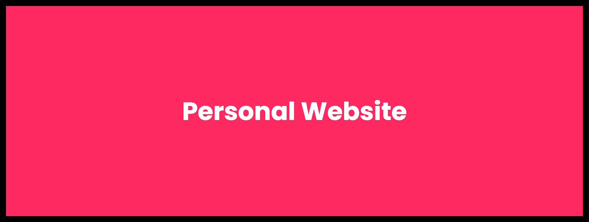

## **Requirements**

1. [Node.js LTS or 18+](https://nodejs.org/en) 
2. [Visual Studio Code](https://code.visualstudio.com/)
3. [Astro extension for Visual Studio Code - **Optional**](https://marketplace.visualstudio.com/items?itemName=astro-build.astro-vscode)

## **Features**
1. Image optimization using Astro.
2. Content folder for images.
3. Retrieve itch.io games.

## **How To's**
### **How to run development server**
After installing the required tools and extensions from [Requirements Section](#requirements), you need to:
1. Open your project in Visual Studio Code.
2. Open terminal using CTRL + ` (or CMD for Mac)
3. Type `npm i` or `npm install` to install all dependencies. 
4. Once installing is complete, type `npm run dev` to run a dev server. 
5. ENJOY coding!

### **Create Custom Themes**

1. Head to the directory `src/styles/`
2. Open `themes.css` with your favorite IDE (or notepad if fancy)
3. You can follow some examples there to create your own but here's a better template for you to create your own:
```css
[data-theme="name-of-the-theme"] {
  --primary-color: #hexcode; /* rgb, hsl, normal name colors and all that are fine */
  --secondary-color: #hexcode; /* rgb, hsl, normal name colors and all that are fine */
  --text-color: #hexcode; /* rgb, hsl, normal name colors and all that are fine */
}
```
4. Once that's done, you can quickly push your project and GitHub actions will build your site.

<details>
<summary>
<b>How does this work automatically</b>
</summary>

There's a script called extractThemes.js inside **src/scripts/** and that helps to extract the data-theme value using RegEx from themes.css
</details>

### **How to add new artwork/images?**

1. Head to `src/assets/showcase/` folder.
2. Paste your image there or download it there.
3. The name is very important; follow the **number-name.(png | webp | jpeg | jpg)** pattern. For example, `1-my-picture.png`.
4. The number in the name above is the order of the images shown on the website. The name after the number is the identifier for adding more metadata to the image. 


